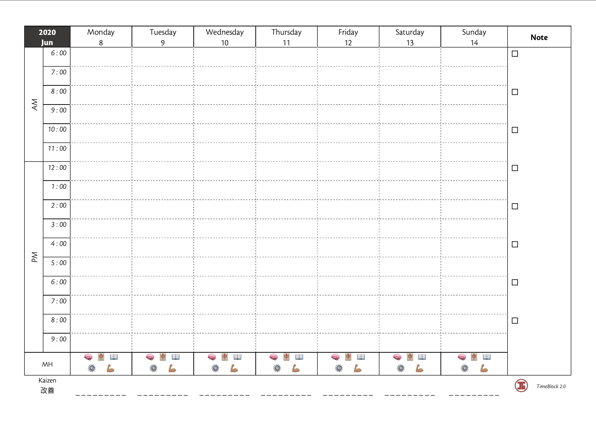

# planner-generator
A personal planner template in word, based on the 'time-blocking method' by Cal Newport, and my old planner template from my high school.

>I do really want to automate this into a web app, where I can generate the planner for the whole year in a pdf. I do know jspdf exists but still looking into it.

